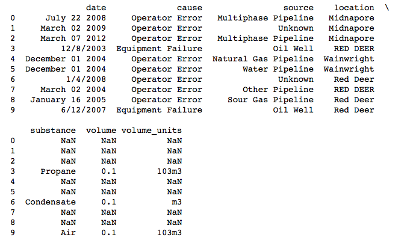

DSCI 522
================

Contributors
------------

-   `Alycia Butterworth`: [alyciakb](https://github.com/alyciakb)
-   `Huijue (Juno) Chen`: [huijuechen](https://github.com/huijuechen)

Latest
------

-   Date: November 15, 2018
-   Release v1.0

Data Set
--------

We are using the dataset "Alberta Oil Spills 1975-2013" from Energy Resources Conservation Board (ERCB), provided by the City of Edmonton. The dataset can be found [online here.](https://data.edmonton.ca/Environmental-Services/Alberta-Oil-Spills-1975-2013/ek45-xtjs)

**To load the data set in Python:**

```Python
import pandas as pd

oil_spills = pd.read_csv("data/AlbertaOilSpills_1975-2013.csv") 
print(oil_spills.head(10))
```


-----------------------------

Question for Initial Analysis
-----------------------------

Are we able to predict with 90% or more accuracy whether an Alberta oil spill is caused by equipment failure or operator error when given the inputs: spill location, time of year (month), source (well, pipeline, etc), type of substance spilled and volume spilled?

Given the following inputs: spill location, time of year (month), source (well, pipeline, etc), type of substance spilled and volume spilled, are we able to predict with 90% or more accuracy whether an Alberta oil spill is caused by equipment failure or operator error?

*This is predictive? Or exploratory using predictive mechanisms?*

-----------------------------

Analysis Plan
-------------

First, we will clean our data set to only use data points that have all the necessary input and output data. We will then create five graphs, one for each feature. The graphs will have two sets of data displayed: how the feature relates to target 1 (Equipment Failure) and how the feature relates to target 2 (Operator Error). If all of the graphs show little differences between those two sets of data, we can expect that they are not indicitive of the cause of the oil spill and that our model will not be accurate in predicting the target.

Regardless, we will then create a supervised learning decision tree model that will take the following five features and output one of the following targets:

**Features:**
  1. spill location
  2. time of year (month)
  3. source (well, pipeline, etc)
  4. type of substance released
  5. volume released

**Target Options:**
  1. Equipment Failure
  2. Operator Error
  
The next step is to test the model using the same data set to see if the model predicts the correct target. Creating a dataframe that compares the true targets to the predicted targets, we can calculate and communicate the accuracy of our model.

-----------------------------

Analysis Presentation
---------------------

We will have the following series of graphics to present with our written analysis:
 1. Graphs that show how each feature relates to each target
 2. The decision tree that shows how the model is making the decision
 3. A table that shows the accuracy of our model predictions
