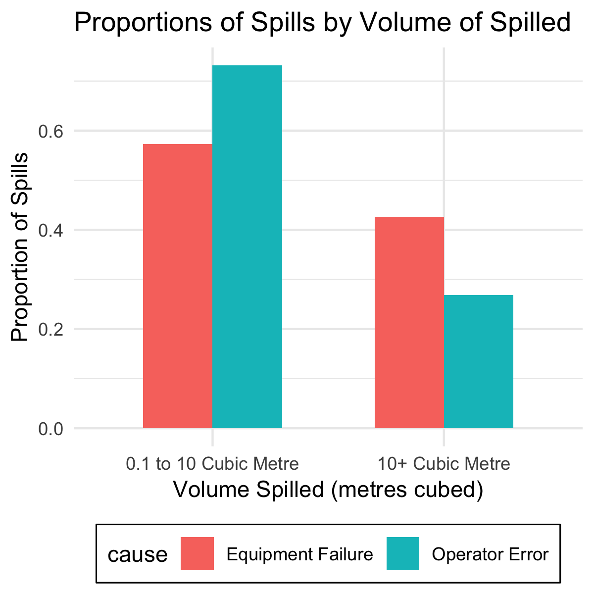

Alberta Oil Spills Final Report
================
Dec. 7, 2018

Introduction
------------

The energy industry in Canada is massive! Canada is the 6th largest producer of energy in the world and energy accounts for over 10% of our national GDP and over 20% of our exports. The largest provincial contributor to Canada's energy sector is Alberta, with its oil and gas production. Alberta's 'proven oil reserves' are so large that they rank third in the world, behind only Venezuela and Saudi Arabia. With the large amount of production that's occurring in Alberta, there's also many spill related incidents occurring. On average, there are four incidents per day resulting in the spilling of some type of substance. In 37 years of collecting data, between 1975 and 2013, the Energy Resources Conservation Board (ERCB) recorded over 60,000 incidents in Alberta.

In more recent years, the ERCB has divided the cause of these spills into two main categories: equipment malfunction and operator (human) error. This brings us to the purpose of this analysis: to answer the question, "What are the three factors that are most predictive of the cause of spill incidents in the Alberta oil industry?"

The two spill causes we looked at were: Equipment Failure and Operator (human) Error. The factors we tested on were: field house location of the spill, the quarter of year which it occurred, the source of the spill (well, pipeline or battery), the substance spilled (oil, gas production, or water), and the volume spilled.

The Data
--------

The data we used in this analysis was compiled and managed by the Energy Resources Conservation Board (ERCB) and spans 12 years, 2002-2013. To clean the data, we removed all incidents that did not have complete data about the five features or target cause types, and did not fall into our generalized source or substance categories.

We will use the following contents from the data:

| Column Names  | Data Type | Description                                         |
|---------------|-----------|-----------------------------------------------------|
| cause         | String    | Identifier for a particular cause of spill          |
| source        | String    | Equipment source of the spill incident              |
| location      | String    | Location of the spill incident                      |
| substance     | String    | Substance of the spill incident                     |
| volume        | Numeric   | Volume of the substance spilled (unit: cubic metre) |
| year\_quarter | Numeric   | Quarter of the year for when the spill occurred     |

*Table 1: A description of what information each of the columns in our data set contain and the type of data they are.*

After cleaning our data set, we had 10,985 observations and produced the following table:

|    X| date       | cause             | source   | location     | substance |  volume|  year\_quarter|
|----:|:-----------|:------------------|:---------|:-------------|:----------|-------:|--------------:|
|    1| 1/28/2013  | Operator Error    | well     | WAINWRIGHT   | oil       |       1|              1|
|    2| 11/10/2012 | Equipment Failure | battery  | BONNYVILLE   | water     |       2|              4|
|    3| 3/29/2007  | Equipment Failure | pipeline | MEDICINE HAT | gas       |       2|              1|
|    4| 3/21/2008  | Equipment Failure | pipeline | MEDICINE HAT | gas       |       2|              1|
|    5| 4/3/2008   | Equipment Failure | pipeline | MEDICINE HAT | gas       |       2|              2|
|    6| 11/2/2005  | Operator Error    | pipeline | MEDICINE HAT | oil       |       1|              4|

*Table 2: A Sample of the Alberta Oil Spills Cleaned Data Set*

------------------------------------------------------------------------

The majority of the spills (9,082 observations) were as a result of equipment failure, and the remaining 1,903 were a result of operator error.

*Figure 1: Number of oil spill incidents caused by the two target causes, Equipment Failure and Operator Error, that occurred between 2002-2013.*

Due to the large difference in the number of equipment failure versus operator error caused spills, we looked at proportions to visualize each factor in a comparative way. For example, on the location graph below you can see that almost 24% of all operator error caused spills occur in Bonnyville, whereas only 10% of all equipment failure caused spills occur in Bonnyville.

*Figure 2: Proportions of Alberta oil spills of each cause type by field house location where the spill occurred. The pink bars represent equipment failure caused spills and the proportions of the pink bars will add to 1.0. The blue bars represent operator error caused spills and the proportions of the blue bars will add to 1.0.*

*Figure 3: Proportions of Alberta oil spills of each cause type by the quarter of the year that the spill occurred. The pink bars represent equipment failure caused spills and the proportions of the pink bars will add to 1.0. The blue bars represent operator error caused spills and the proportions of the blue bars will add to 1.0.*

*Figure 4: Proportions of Alberta oil spills of each cause type by the equipment/site type source of the spill, either well, pipeline or battery (a battery is a production area that stores, measures, and separates oil.) The pink bars represent equipment failure caused spills and the proportions of the pink bars will add to 1.0. The blue bars represent operator error caused spills and the proportions of the blue bars will add to 1.0.*

*Figure 5: Proportions of Alberta oil spill incidents of each cause type by the substance spilled, either oil, gas production, or water. The pink bars represent equipment failure caused spills and the proportions of the pink bars will add to 1.0. The blue bars represent operator error caused spills and the proportions of the blue bars will add to 1.0.*

*Figure 6: Proportions of Alberta oil spills of each cause type by the volume of substance spilled. The volumes are measured in metres cubed, and separated into two groups: A "small" spill that resulted in 0.1 to 10*m*3 volume of a substance being spilled or a "large" spill that resulted in over 10*m*3 volume being spilled. The pink bars represent equipment failure caused spills and the proportions of the pink bars will add to 1.0. The blue bars represent operator error caused spills and the proportions of the blue bars will add to 1.0.*

A note about how we chose our spill volume groups (Figure 6) for the analysis: We used only two volume groups because over 60% of our data fall into the "small" category and we did not want to have the number of observations per volume group to be highly skewed. This is a drawback of our analysis, because the "large" spill category includes spills that are anywhere from 10.1*m*3 up to the largest spill in our data set, an equipment failure caused pipeline incident in St. Albert in 2009 that resulted in 25 million *m*3 of gas production being spilled. Obviously, those two spills are of a very different magnitude, but to keep the volume groups simple, fall into the same category in this analysis.

The Analysis
------------

In order to rank the predictive quality of our factors, we first fit a decision tree model. We represented each of our categorical variables as numbers. *If you are interested in which numbers are associated with which variable, you can find the data in csv files within the [results](../results) folder.* We split our data into a training group (80% of the data) and a test group (20% of the data). We tested many potential depths and used 10-fold cross validation with the training data to pick a best depth. We tested the cross-validation model accuracy at the different depths, and the graphical comparison is shown as below:

*Figure 7: Each training accuracy was obtained using 10-fold cross-validation on the training data (with random state=10). You can see the accuracy variations across different max\_depth settings of decision trees.*

As the highest training accuracy was reached at the maximum depth of 4 for the decision tree, we produced the following decision tree with setting the hyperparameter `max_depth = 4`:

*Figure 8: A decision tree of depth 4, used for determining cause type of an oil spill, based on the factors: field house location of spill, time of year, source of spill, substance spilled, and volume spilled. The orange boxes represent the decision tree choosing the target cause type "Equipment Failure", the blue boxes represent the decision tree choosing the target cause type "Operatore Error". The darker the blue or orange, the better the gini score and the more certain the decision tree is about the cause type, the lighter the boxes, the less certainty there is behind the cause type decision.*

There are four splits in this decision tree: the first one is on the feature `source`, the second one is on two features `source` and `location`, then it splits on three features `substance`, `year_quarter` and `volume`, the last one is on `location`, `substance`, and `year_quarter`. When the tree first splits on `source`, it splits on the value of 1.5. Since we converted `source` from categorical variable to numerical variable earlier, the split actually indicates that if the source of the oil spill is 0 or 1, i.e. "battery" or "pipeline", it would belongs to the left tree, otherwise, the right tree are the oil spills with the source as 2, i.e. "well".

The model is significantly more likely to predict "equipment failure" as the cause of the spill (as indicated by the orange coloured nodes in the model) because the majority of spills occurring in Alberta are caused by equipment failure. However, in specific cases, the model will predict "operator error" (blue node) as the cause of the spill.

After producing our model, we scored its accuracy. The training and test accuracy scores for our final decision tree are:

| Type              |   Score|
|:------------------|-------:|
| Training Accuracy |  0.8330|
| Test Accuracy     |  0.8252|

*Table 3: The training and test accuracy scores for the decision tree model used to determine whether an Alberta oil spill incident is caused by equipment failure or operator error.*

The Results
-----------

We used our decision tree model to calculate the gini scores for each of the five factors and ranked them as most predictive to least:

|  Rank| Factor        | Gini.Importance |
|-----:|:--------------|:----------------|
|     1| source        | 0.03388         |
|     2| location      | 0.00383         |
|     3| substance     | 0.00338         |
|     4| volume        | 0.00193         |
|     5| year\_quarter | 0.00086         |

*Table 4: Ranking the five factors: location, time of year, source of spill, substance spilled, and volume of substance spilled, from most to least predictive based on their decision tree scores.*

The Gini importance, also known as Mean Decrease in Impurity (MDI), calculates feature importance as the proportion of the amount of splits that include the feature to the number of samples it splits. Higher value represents higher importance of a feature.

Our results show that the best predictor in our analysis was the `source` of the spill. As you can see, the gini importance score for `source` is ten times higher than the next two best predictors (`location` and `substance`). Therefore, `source` is a significantly better predictor than any of the other features we tested on. This result is compatible with our data visualization at the start of this report. You can see in Figure 4 that there are large differences between the two cause types for each variable within the `source` factor.

The question we set out to answer with this project was: "What are the top three predictors of the cause of an oil spill incident in Alberta?" Based on our analysis, the top predictors are:

1.  Source of the spill
2.  Field house location of the spill
3.  Type of substance spilled

Limitations
-----------

We understand that our analysis has its limitations:

-   We only looked at five factors, but there are likely many other factors that relate to the cause of an oil spill.
-   The data set was missing values in many places, which meant that we are only taking into consideration spills that we have full information on and ignoring all spills that we have only partial information about.
-   We did not take into consideration the quantity of oil or gas being produced or moved by the location or sources.
-   We addressed the substance spilled and volume spilled as separate entities, but it might be useful to think of them together (e.g. is differences in the average volumes spilled of each individual substance depending on the cause?)
-   There is likely a more accurate machine learning approach to answer this question, but we haven't learned it yet.

Next Steps
----------

This analysis is only a tiny sliver of information that can be learned from this data set (and related data). If we were to continue working with it, the next questions we would like to ask are:

1.  Is production volume in an area a predictor of spill cause?
2.  Do spills increase or decrease linearly with production volume?
3.  Are the overall number of incidents per year increasing or decreasing over time?
4.  Are the number of incidents by cause type increasing or decreasing over time?
5.  Why are Operator Error caused incidents in Bonnyville so high? (See Figure 2)

The more we understand about the factors related to spill incidents, the more we can start to answer why and how spills happen. If we understand why and how they happen, companies can take preventative measures to hopefully help reduce the number of spills occurring and the severity of the spills.

References
----------

1.  *[Alberta Oil Spills 1975-2013](https://data.edmonton.ca/Environmental-Services/Alberta-Oil-Spills-1975-2013/ek45-xtjs)*, data set, City of Edmonton. Retrieved: November 2018.
2.  Young, Leslie (2013), *[Crude Awakening: 37 years of oil spills in Alberta](https://globalnews.ca/news/571494/introduction-37-years-of-oil-spills-in-alberta/)*, Global News. Retrieved: November 2018.
3.  *[Energy and the Economy](https://www.nrcan.gc.ca/energy/facts/energy-economy/20062#L2)*, Natural Resources Canada. Retrieved: November 2018.
4.  *[Alberta's Oil Reserves Compared to Other Countries](https://open.alberta.ca/dataset/4ad7b5c8-8fdf-42a4-bec4-e57fae9f058e/resource/e5dd5f00-5139-4b0d-ba45-4990824b81af/download/did-you-know-fact-sheet-7-sept28.pdf)*, Government of Alberta. Retrieved: November 2018.
